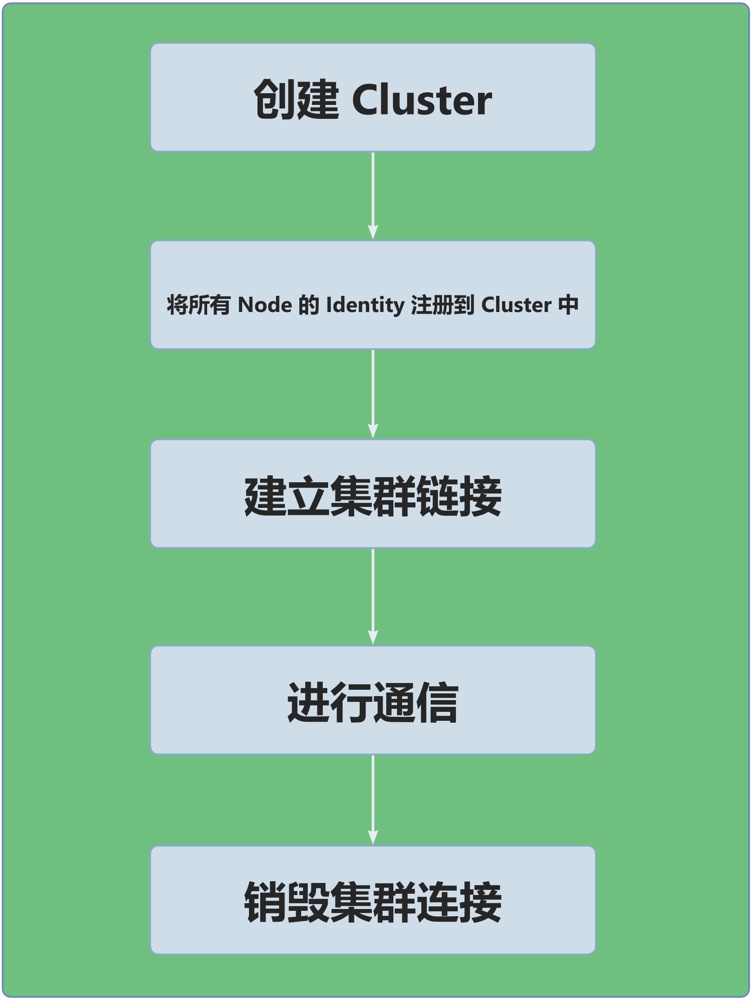

# TDCF

**TDCF (Tiny Distribute Communication Framework)，是一个分布式通信算法框架，为分布式主从节点集群提供轻量级、高性能的并行通信管理。**

## 简要概述

- 提供了三种通信拓扑结构，包括 Star、Ring、DBT(Double Binary Tree)；
- 支持 Broadcast、Scatter、Reduce、AllReduce、ReduceScatter 五种通信原语。
- 支持不同通信拓扑结构嵌套，可根据实际情况在同一集群中的不同的节点之间使用不同拓扑结构提高通信效率。
- 框架仅提供上层通信算法，使用场景自由定制：
    - 通过实现 Communicator抽象类，定义底层通信细节。
    - 通过实现 Data抽象类，定义传输数据类型。
    - 通过实现 Identity抽象类，定义节点唯一标识。
    - 通过实现 ProcessingRules抽象类，标识数据处理规则。
    - 通过实现 Processor抽象类，定义数据处理细节。
- 轻量级框架，便于使用：
    - 对外接口简单易用，整个通信流程步骤简洁精悍。
    - 无需引入任何依赖，只需实现必要的对内接口。

## 安装与卸载

以 Linux 系统下，使用 CMake 构建为示例：

- 安装（进入源码根目录下）

```` shell

mkdir build
cd build
cmake .. -DCMAKE_INSTALL_PREFIX=/path/to/install
make install

````

- 卸载（进入 build 目录下）

```` shell

make uninstall

````

## 通信算法

### Ring

Ring 将所有处理单元按环形排列（每个节点仅与左右相邻节点直接连接），数据通过环形路径依次传递，每个节点在接收数据后，仅需转发给下一个节点，无需全局连接。

### Star

Star 以一个 “中心节点”为核心，所有其他节点仅与中心节点直接连接，不与其他叶节点通信。

### DBT

DBT（Double Binary Tree，双二叉树）算法是并行计算中一种高效的集体通信算法，基于两棵并行的二叉树拓扑结构实现数据传输，旨在解决单树结构的带宽瓶颈问题，充分利用双向通信带宽。

## 通信原语

### broadcast

将 root节点 的数据广播到其他节点。

<div style="background-color: #F5F5F5; text-align: center;">
    
</div>

### scatter

将 root节点 的数据均分并散布至其他节点。

<div style="background-color: #F5F5F5; text-align: center;">
    
</div>

### reduce

将所有节点的输入数据进行归约操作后，再把结果发送到 root节点。

<div style="background-color: #F5F5F5; text-align: center;">
    
</div>

### all_reduce

将所有节点的输入数据进行归约操作后，再把结果发送到所有节点。

<div style="background-color: #F5F5F5; text-align: center;">
    
</div>

### reduce_scatter

将所有节点各个部分的输入进行归约操作后，再把结果按照节点编号分散到各个节点。

<div style="background-color: #F5F5F5; text-align: center;">
    
</div>

[通信原语图片来源](https://www.hiascend.com/document/detail/zh/canncommercial/81RC1/developmentguide/hccl/hcclug/hcclug_000004.html)

## 通信流程

<div style="text-align: center;">
  
</div>

## 使用示例
