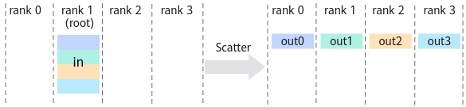

# 数据操作

## broadcast
将 root节点 的数据广播到其他节点。

## scatter
将 root节点 的数据均分并散布至其他节点。

## reduce
将所有节点的输入数据进行归约操作后，再把结果发送到 root节点。

## all_gather
将所有节点的各个部分输入重新排序，然后按顺序将结果发送到所有节点。

## all_reduce
将所有节点的输入数据进行归约操作后，再把结果发送到所有节点。

## reduce_scatter
将所有节点各个部分的输入进行归约操作后，再把结果按照节点编号分散到各个节点。

## all_to_all
向所有节点发送相同数据，并从所有节点接收相同数据量的数据。

[图片来源](https://www.hiascend.com/document/detail/zh/canncommercial/81RC1/developmentguide/hccl/hcclug/hcclug_000004.html)
